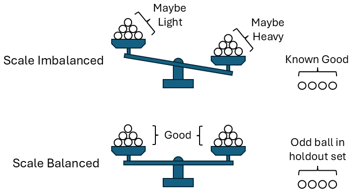

# Oddball
A classic problem in recreational mathematics is to identify an
incorrectly-weighted ball in a set of N otherwise identical balls.
The challenge is to use a balance scale a maximum of W times,
where W is typically much smaller than N.
The solution must identify which ball has the incorrect weight
and whether the ball is heavier or lighter than the rest.

**Oddball** implements a solver for this problem based on Boolean Satisfiability.
The set of balls on the left and right sides of the balance scale are determined
for each of the W weighings.
The outcomes of the weighings are then looked up in a truth table that tells
which ball is wrong and whether it is light or heavy.

A simplifying assumption is made that the balls to be weighed are determined *a priori*.
That is, the choice of what to weigh next is not dependent on the outcome of the previous weighings.

## Installation

    # git clone https://github.com/acmihal/oddball.git
    # cd oddball
    # pip install -e .

## Usage

    # oddball -h
    # oddball 9 3

The program is also capable of exporting the formulation in CNF format for an external SAT solver:

    # oddball 9 3 --cnf oddball_9_3.cnf --skip-solver
    # kissat oddball_9_3.cnf | tee oddball_9_3.cert

A certificate produced by an external solver can be reimported to print the solution:

    # oddball 9 3 --cert oddball_9_3.cert

## Output

The Solution section gives the balls to be weighed for each of the W weighings. For example:

    # oddball 9 3
    Solving for 9 balls and 3 weighings

    Solution:
    W0: [ 0,  2,  3,  7] <=> [ 1,  4,  6,  8]
    W1: [ 0,  1,  4] <=> [ 2,  6,  8]
    W2: [ 1,  3,  6] <=> [ 4,  5,  8]

The first weighing should have balls 0, 2, 3, and 7 on the left side of the scale, and balls 1, 4, 6, and 8
on the right side of the scale. If the heavy ball is on the left or the light ball is on the right,
the outcome will be **>** (left heavier than right). If the light ball is on the left or the heavy ball
is on the right, the outcome will be **<** (right heavier than left).
If the incorrectly-weighted ball is not on the scale, the result will be **=** (both sides equal).
In this example, that would mean that the incorrectly-weighed ball must be ball 5.

The next section of the output is the Truth Table.
Look up the row in the Truth Table that matches the outcomes of the weighings to get the answer.

    Truth Table:
    ix  W0  W1  W2   Result
     0   <   <   <   8+
     1   <   <   =   0-
     2   <   <   >   6+
     3   <   =   <   3-
     4   <   =   =   7-
     5   <   =   >
     6   <   >   <   4+
     7   <   >   =   2-
     8   <   >   >   1+
     9   =   <   <
    10   =   <   =
    11   =   <   >
    12   =   =   <   5+
    13   =   =   =
    14   =   =   >   5-
    15   =   >   <
    16   =   >   =
    17   =   >   >
    18   >   <   <   1-
    19   >   <   =   2+
    20   >   <   >   4-
    21   >   =   <
    22   >   =   =   7+
    23   >   =   >   3+
    24   >   >   <   6-
    25   >   >   =   0+
    26   >   >   >   8-

Continuing with the above example, let's say that weighing 0 had outcome **>** (left side heavier),
and weighing 1 and 2 both had outcome **=** (both sides equal).
These outcomes are in row 22 of the truth table, and that row has the result **7+**.
This means the answer is that ball 7 is the incorrectly-weighted ball and it is heavier than the others.
A result with a minus sign means the incorrectly-weighted ball is lighter than the others.

Some truth table rows don't have any result. This is normal. Some combinations of weighing outcomes are impossible,
because the bad ball must have tipped the scale at some point.

In the last section of output, **Oddball** thoroughly tests the answer for you.
For every possible ball being the bad ball, and for both the heavier and lighter case,
all the weighings are simulated and the result is looked up in the truth table.
**Oddball** makes sure the truth table gives the correct answer in all cases.

For example the first test checks the case where ball 0 is light:

    Test 0-:
        W0: [ 0,  2,  3,  7] < [ 1,  4,  6,  8]
        W1: [ 0,  1,  4] < [ 2,  6,  8]
        W2: [ 1,  3,  6] = [ 4,  5,  8]
        Truth table result: ['0-'] is correct

In weighing 0, ball 0 is on the left, so the outcome is **<** (left side is lighter than the right side).
In weighing 1, ball 0 is on the left again so the outcome is again **<**.
In weighing 2, ball 0 is not on the scale, so the scale is balanced (outcome **=**).

The results **<**, **<**, and **=** correspond to row 1 in the truth table, which has the right answer **0-**.

## Details

**Oddball** is implemented in Python using Z3Py. The constraint formulation uses Boolean variables to indicate that a particular pair of balls are on opposite sides of the scale in each weighing. Combined with the result of the weighing, these Boolean variables imply possibilities about which ball is bad.

If the scale is **balanced** then none of the balls on the scale are bad. The bad ball must be in the set that is not on the scale. If the scale is **not balanced** then the balls on the light side of the scale are not heavy, and the balls on the heavy side of the scale are not light.

The goal of the SAT solver is to choose pairs of balls to weigh in each weighing such that each truth table row implies at most one result. Also, each ball-error combination must appear at least once in the truth table.

A collection of symmetry-breaking strategies is available via the **--strategy** parameter. Multiple strategies can be used in combination, but not all strategies are mutually compatible and may result in UNSAT configurations.

| Strategy | Description |
| --- | --- |
| TruthTableOrdering | This is a permutation-symmetry breaking strategy that enforces the balls in the truth table result column to appear in ascending order. |
| ZeroPlus | Enforces that the 0+ error occurs in the top half of the truth table. |
| Weigh0Ascending | Enforces that the balls that go onto the scale in the first weighing have to be placed in sequential pairs. First ball 0 is placed on the left side of the scale and ball 1 on the right. The next balls that can be placed are 2 and 3 on the left and right respectively. Ball N-1 cannot be on the scale in the first weighing. |
| TruthTableForced | Forces the truth table results to the ball numbers in sequence, starting at row 1. This strategy generates UNSAT configurations for benchmarking. |

The Z3 solver tactic can also be changed with the **--tactic** parameter. Allowable values are qffd, qflia, and z3-default.

## Proposed Benchmarks

A set of hand-selected benchmarks for measuring the performance of SAT solvers can be generated using the **generate_benchmarks.sh** command.

| Benchmark | Satisfiable? | Kissat Runtime (seconds) |
| --- | --- | --- |
| oddball_17_5_ttf | UNSAT | 0.84 |
| oddball_19_5_ttf | UNSAT | 2.27 |
| oddball_20_4_ttf | UNSAT | 4.21 |
| oddball_20_5_ttf | UNSAT | 4.84 |
| oddball_22_5_ttf | UNSAT | 10.17 |
| oddball_13_4_ttf | UNSAT | 12.74 |
| oddball_13_5_ttf | UNSAT | 13.05 |
| oddball_22_4_ttf | UNSAT | 25.85 |
| oddball_19_4_ttf | UNSAT | 47.31 |
| oddball_23_4_ttf | UNSAT | 176.04 |
| oddball_24_5_ttf | UNSAT | 180.78 |
| oddball_24_4_ttf | UNSAT | 202.91 |
| oddball_23_5_ttf | UNSAT | 402.59 |
| oddball_26_5_ttf | UNSAT | 685.69 |
| oddball_26_4_ttf | UNSAT | 930.69 |
| oddball_28_5_ttf | UNSAT | 1115.17 |
| oddball_28_4_ttf | UNSAT | 1922.99 |
| oddball_33_4_ttf | UNSAT | 2078.47 |
| oddball_29_5_ttf | UNSAT | 2251.59 |
| oddball_29_4_ttf | UNSAT | 2712.45 |
| oddball_57_5_tto_zp | SAT | 799.63 |
| oddball_53_5_tto_zp | SAT | 811.38 |
| oddball_51_5_tto_zp | SAT | 834.35 |
| oddball_67_5_tto_zp | SAT | 922.14 |
| oddball_43_5_tto_zp | SAT | 1127.32 |
| oddball_69_5_tto_zp | SAT | 1244.96 |
| oddball_80_5_tto_zp | SAT | 1398.21 |
| oddball_74_5_tto_zp | SAT | 1552.76 |
| oddball_79_5_tto_zp | SAT | 1612.79 |
| oddball_54_5_tto_zp | SAT | 1615.02 |
| oddball_50_5_tto_zp | SAT | 1702.85 |
| oddball_112_5_ttf | SAT | 1862.08 |
| oddball_56_5_tto_zp | SAT | 1885.56 |
| oddball_76_5_tto_zp | SAT | 1996.42 |
| oddball_44_5_tto_zp | SAT | 2118.93 |
| oddball_78_5_tto_zp | SAT | 2283.13 |
| oddball_70_5_tto_zp | SAT | 2333.77 |
| oddball_47_5_tto_zp | SAT | 2588.91 |
| oddball_52_5_tto_zp | SAT | 2987.92 |
| oddball_97_5_ttf | SAT | 3079.98 |

## Examples

### 2 Balls and 1 Weighing

    # oddball 2 1
    Solving for 2 balls and 1 weighings
    No solution exists for 2 balls and 1 weighings.

If the problem cannot be solved, **Oddball** will print a message like this.

If there are only two balls, the only thing you can do is put them on opposite sides of the scale.
The scale won't balance, but you can't tell if it is because one side is heavier than it is supposed to be or lighter than it is supposed to be.

### 3 Balls and 2 Weighings
    # oddball 3 2
    Solving for 3 balls and 2 weighings
    
    Solution:
    W0: [ 0] <=> [ 1]
    W1: [ 2] <=> [ 1]
    
    Truth Table:
    ix  W0  W1   Result
     0   <   <   1+
     1   <   =   0-
     2   <   >
     3   =   <   2-
     4   =   =
     5   =   >   2+
     6   >   <
     7   >   =   0+
     8   >   >   1-
    
    Test 0-:
        W0: [ 0] < [ 1]
        W1: [ 2] = [ 1]
        Truth table result: ['0-'] is correct
    
    Test 0+:
        W0: [ 0] > [ 1]
        W1: [ 2] = [ 1]
        Truth table result: ['0+'] is correct
    
    Test 1-:
        W0: [ 0] > [ 1]
        W1: [ 2] > [ 1]
        Truth table result: ['1-'] is correct
    
    Test 1+:
        W0: [ 0] < [ 1]
        W1: [ 2] < [ 1]
        Truth table result: ['1+'] is correct
    
    Test 2-:
        W0: [ 0] = [ 1]
        W1: [ 2] < [ 1]
        Truth table result: ['2-'] is correct
    
    Test 2+:
        W0: [ 0] = [ 1]
        W1: [ 2] > [ 1]
        Truth table result: ['2+'] is correct
    
    Total correct results: 6
    Total incorrect results: 0

### 12 Balls and 3 Weighings
    # oddball 12 3
    Solving for 12 balls and 3 weighings
    
    Solution:
    W0: [ 0,  6,  7,  9] <=> [ 1,  2,  8, 10]
    W1: [ 4,  5,  6,  7] <=> [ 0,  3,  9, 10]
    W2: [ 0,  1,  3,  4] <=> [ 2,  6, 10, 11]
    
    Truth Table:
    ix  W0  W1  W2   Result
     0   <   <   <   10+
     1   <   <   =   7-
     2   <   <   >   6-
     3   <   =   <   2+
     4   <   =   =   8+
     5   <   =   >   1+
     6   <   >   <   0-
     7   <   >   =   9-
     8   <   >   >
     9   =   <   <   4-
    10   =   <   =   5-
    11   =   <   >   3+
    12   =   =   <   11+
    13   =   =   =
    14   =   =   >   11-
    15   =   >   <   3-
    16   =   >   =   5+
    17   =   >   >   4+
    18   >   <   <
    19   >   <   =   9+
    20   >   <   >   0+
    21   >   =   <   1-
    22   >   =   =   8-
    23   >   =   >   2-
    24   >   >   <   6+
    25   >   >   =   7+
    26   >   >   >   10-
    
    Test 0-:
        W0: [ 0,  6,  7,  9] < [ 1,  2,  8, 10]
        W1: [ 4,  5,  6,  7] > [ 0,  3,  9, 10]
        W2: [ 0,  1,  3,  4] < [ 2,  6, 10, 11]
        Truth table result: ['0-'] is correct
    
    Test 0+:
        W0: [ 0,  6,  7,  9] > [ 1,  2,  8, 10]
        W1: [ 4,  5,  6,  7] < [ 0,  3,  9, 10]
        W2: [ 0,  1,  3,  4] > [ 2,  6, 10, 11]
        Truth table result: ['0+'] is correct
    
    Test 1-:
        W0: [ 0,  6,  7,  9] > [ 1,  2,  8, 10]
        W1: [ 4,  5,  6,  7] = [ 0,  3,  9, 10]
        W2: [ 0,  1,  3,  4] < [ 2,  6, 10, 11]
        Truth table result: ['1-'] is correct
    
    Test 1+:
        W0: [ 0,  6,  7,  9] < [ 1,  2,  8, 10]
        W1: [ 4,  5,  6,  7] = [ 0,  3,  9, 10]
        W2: [ 0,  1,  3,  4] > [ 2,  6, 10, 11]
        Truth table result: ['1+'] is correct
    
    Test 2-:
        W0: [ 0,  6,  7,  9] > [ 1,  2,  8, 10]
        W1: [ 4,  5,  6,  7] = [ 0,  3,  9, 10]
        W2: [ 0,  1,  3,  4] > [ 2,  6, 10, 11]
        Truth table result: ['2-'] is correct
    
    Test 2+:
        W0: [ 0,  6,  7,  9] < [ 1,  2,  8, 10]
        W1: [ 4,  5,  6,  7] = [ 0,  3,  9, 10]
        W2: [ 0,  1,  3,  4] < [ 2,  6, 10, 11]
        Truth table result: ['2+'] is correct
    
    Test 3-:
        W0: [ 0,  6,  7,  9] = [ 1,  2,  8, 10]
        W1: [ 4,  5,  6,  7] > [ 0,  3,  9, 10]
        W2: [ 0,  1,  3,  4] < [ 2,  6, 10, 11]
        Truth table result: ['3-'] is correct
    
    Test 3+:
        W0: [ 0,  6,  7,  9] = [ 1,  2,  8, 10]
        W1: [ 4,  5,  6,  7] < [ 0,  3,  9, 10]
        W2: [ 0,  1,  3,  4] > [ 2,  6, 10, 11]
        Truth table result: ['3+'] is correct
    
    Test 4-:
        W0: [ 0,  6,  7,  9] = [ 1,  2,  8, 10]
        W1: [ 4,  5,  6,  7] < [ 0,  3,  9, 10]
        W2: [ 0,  1,  3,  4] < [ 2,  6, 10, 11]
        Truth table result: ['4-'] is correct
    
    Test 4+:
        W0: [ 0,  6,  7,  9] = [ 1,  2,  8, 10]
        W1: [ 4,  5,  6,  7] > [ 0,  3,  9, 10]
        W2: [ 0,  1,  3,  4] > [ 2,  6, 10, 11]
        Truth table result: ['4+'] is correct
    
    Test 5-:
        W0: [ 0,  6,  7,  9] = [ 1,  2,  8, 10]
        W1: [ 4,  5,  6,  7] < [ 0,  3,  9, 10]
        W2: [ 0,  1,  3,  4] = [ 2,  6, 10, 11]
        Truth table result: ['5-'] is correct
    
    Test 5+:
        W0: [ 0,  6,  7,  9] = [ 1,  2,  8, 10]
        W1: [ 4,  5,  6,  7] > [ 0,  3,  9, 10]
        W2: [ 0,  1,  3,  4] = [ 2,  6, 10, 11]
        Truth table result: ['5+'] is correct
    
    Test 6-:
        W0: [ 0,  6,  7,  9] < [ 1,  2,  8, 10]
        W1: [ 4,  5,  6,  7] < [ 0,  3,  9, 10]
        W2: [ 0,  1,  3,  4] > [ 2,  6, 10, 11]
        Truth table result: ['6-'] is correct
    
    Test 6+:
        W0: [ 0,  6,  7,  9] > [ 1,  2,  8, 10]
        W1: [ 4,  5,  6,  7] > [ 0,  3,  9, 10]
        W2: [ 0,  1,  3,  4] < [ 2,  6, 10, 11]
        Truth table result: ['6+'] is correct
    
    Test 7-:
        W0: [ 0,  6,  7,  9] < [ 1,  2,  8, 10]
        W1: [ 4,  5,  6,  7] < [ 0,  3,  9, 10]
        W2: [ 0,  1,  3,  4] = [ 2,  6, 10, 11]
        Truth table result: ['7-'] is correct
    
    Test 7+:
        W0: [ 0,  6,  7,  9] > [ 1,  2,  8, 10]
        W1: [ 4,  5,  6,  7] > [ 0,  3,  9, 10]
        W2: [ 0,  1,  3,  4] = [ 2,  6, 10, 11]
        Truth table result: ['7+'] is correct
    
    Test 8-:
        W0: [ 0,  6,  7,  9] > [ 1,  2,  8, 10]
        W1: [ 4,  5,  6,  7] = [ 0,  3,  9, 10]
        W2: [ 0,  1,  3,  4] = [ 2,  6, 10, 11]
        Truth table result: ['8-'] is correct
    
    Test 8+:
        W0: [ 0,  6,  7,  9] < [ 1,  2,  8, 10]
        W1: [ 4,  5,  6,  7] = [ 0,  3,  9, 10]
        W2: [ 0,  1,  3,  4] = [ 2,  6, 10, 11]
        Truth table result: ['8+'] is correct
    
    Test 9-:
        W0: [ 0,  6,  7,  9] < [ 1,  2,  8, 10]
        W1: [ 4,  5,  6,  7] > [ 0,  3,  9, 10]
        W2: [ 0,  1,  3,  4] = [ 2,  6, 10, 11]
        Truth table result: ['9-'] is correct
    
    Test 9+:
        W0: [ 0,  6,  7,  9] > [ 1,  2,  8, 10]
        W1: [ 4,  5,  6,  7] < [ 0,  3,  9, 10]
        W2: [ 0,  1,  3,  4] = [ 2,  6, 10, 11]
        Truth table result: ['9+'] is correct
    
    Test 10-:
        W0: [ 0,  6,  7,  9] > [ 1,  2,  8, 10]
        W1: [ 4,  5,  6,  7] > [ 0,  3,  9, 10]
        W2: [ 0,  1,  3,  4] > [ 2,  6, 10, 11]
        Truth table result: ['10-'] is correct
    
    Test 10+:
        W0: [ 0,  6,  7,  9] < [ 1,  2,  8, 10]
        W1: [ 4,  5,  6,  7] < [ 0,  3,  9, 10]
        W2: [ 0,  1,  3,  4] < [ 2,  6, 10, 11]
        Truth table result: ['10+'] is correct
    
    Test 11-:
        W0: [ 0,  6,  7,  9] = [ 1,  2,  8, 10]
        W1: [ 4,  5,  6,  7] = [ 0,  3,  9, 10]
        W2: [ 0,  1,  3,  4] > [ 2,  6, 10, 11]
        Truth table result: ['11-'] is correct
    
    Test 11+:
        W0: [ 0,  6,  7,  9] = [ 1,  2,  8, 10]
        W1: [ 4,  5,  6,  7] = [ 0,  3,  9, 10]
        W2: [ 0,  1,  3,  4] < [ 2,  6, 10, 11]
        Truth table result: ['11+'] is correct
    
    Total correct results: 24
    Total incorrect results: 0
